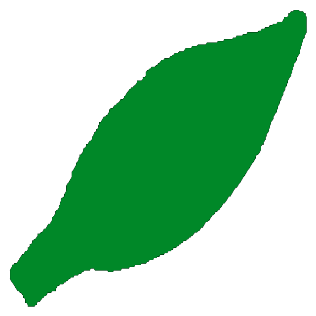

A HTML Canvas Viewer for the AllLeaf Database
=============================================

Written in Javascript (with HTML5 Canvas).

You will need a server that stores the 1.6 Gigabyte (!) of leaf text data.

Name the root of the data directory 'data'.
Place the two php files list.php and get.php into the data root (so they can access ./data/ as a sub directory). The scripts will manage the indexing and the text-to-json conversion which is needed to draw the leaves with Javascript.

 